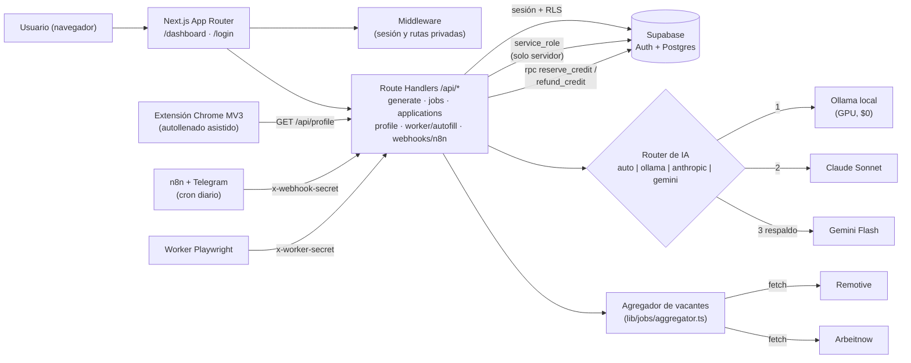

# Job AutoApply — Fases 0, 1, 2 y 3

[](https://github.com/andresaragon/-job-autoapply-app/actions/workflows/ci.yml)

Plataforma integral Next.js con Supabase para datos/autenticación, agregador de vacantes públicas (Remotive & Arbeitnow),
arquitectura de **IA Híbrida** (Ollama Local en GPU RTX 4060, Claude Sonnet 5.5 y Google Gemini), módulo de auto-llenado ATS (Greenhouse, Lever, Ashby)
y puente de webhooks para automatizaciones con n8n y Telegram.

## Qué incluye

- Estructura de **Next.js 16** (App Router, Turbopack) con TypeScript y Tailwind CSS.
- **Autenticación y Sesiones:** Flujo completo de registro, inicio de sesión y callback con Supabase Auth y Middleware de protección de rutas privadas (`/dashboard`, `/dashboard/jobs`, `/dashboard/applications`, `/dashboard/resumes`, `/dashboard/profile`).
- **Perfil de Candidato (`/dashboard/profile`):** Datos persistentes del candidato (nombre, teléfono, LinkedIn, GitHub, portafolio, ubicación) para rellenado automático de formularios.
- **Gestión y Carga de CVs:** Interfaz en `/dashboard/resumes` para subir archivos (`.txt`, `.md`), previsualizar, editar y marcar un CV como principal (`es_actual`) con políticas RLS.
- **Agregador de Vacantes (`/dashboard/jobs`):**
  - Ingesta automática e idempotente desde feeds públicos abiertos (**Remotive** y **Arbeitnow**) sin API keys.
  - Detección automática de sistemas ATS (*Greenhouse, Lever, Ashby, Workday, SmartRecruiters*).
  - Búsqueda reactiva por palabras clave y filtros por modalidad (*100% Remoto* vs *Presencial/Híbrido*) o tipo de ATS.
  - Ingesta manual de vacantes para registrar ofertas directas de LinkedIn.
  - Botón de acción directa **"⚡ Postular con IA"** que precarga la oferta seleccionada en el generador.
- **Seguimiento de Postulaciones (`/dashboard/applications`):**
  - Registro y guardado de postulaciones adaptadas con CV y carta generados.
  - Gestión de ciclo de vida con estados (*Borrador*, *Lista para revisión*, *Enviada*, *En Proceso*, *Entrevista*, *Rechazada*, *¡Oferta!*).
  - Visor modal para inspeccionar y copiar los documentos generados.
- **Exportador de CV a PDF ATS-Friendly (`components/CvPdfModal.tsx`):**
  - Visor con estilos tipográficos (ATS Minimalista, Ejecutivo Serif, Clásico).
  - Formateo de viñetas, secciones semánticas y exportación nativa a PDF (formato Carta) con diseño de una sola columna sin tablas que garantiza máxima puntuación de legibilidad en parsers ATS.
- **Score de Match ATS & Keyword Analyzer (`lib/ats/matcher.ts` & `components/AtsMatchCard.tsx`):**
  - Motor determinista de cálculo de concordancia léxica y semántica entre la vacante y el CV adaptado.
  - Indicador visual interactivo de porcentaje (0-100%), nivel (*Excelente, Bueno, Regular, Bajo*) y desglose por Hard Skills, Soft Skills / Metodologías y Métricas Cuantitativas.
  - Pestañas de palabras clave coincidentes vs. ausentes (con botón de copia en 1 clic) y sugerencias de optimización inmediata para superar los filtros de contratación.
- **Asistente Auto-Fill ATS (`lib/worker/ats/filler.ts` & `/api/worker/autofill`):**
  - Mapeo determinista de campos para Greenhouse, Lever, Ashby y formularios genéricos.
  - Generador de inyector JavaScript (one-click copy) que dispara eventos reactivos del DOM (`input`/`change`) y resalta campos completados en verde.
  - Script runner con Playwright (`worker/autoapply-playwright.mjs`) para ejecución automatizada headless/headed desde terminal o VPS.
- **Extensión de Chrome Manifest V3 (`extension/`):**
  - Extensión de navegador lista para cargar en Chrome o Edge (`chrome://extensions`).
  - Detección automática de sistemas ATS (*Greenhouse, Lever, Ashby, Workday* o genéricos).
  - Autollenado en 1-clic con disparo de eventos nativos de React/HTML5, resaltado visual esmeralda y toast de confirmación en la página.
  - Almacenamiento local seguro (`chrome.storage.local`) con sincronización directa desde la Web App (`/api/profile`).
  - Guía de instalación y uso en [`extension/README.md`](extension/README.md).
- **Puente de Webhooks y Automatización n8n (`app/api/webhooks/n8n/route.ts` & `n8n/`):**
  - Endpoint protegido por token de webhook (`x-webhook-secret`).
  - Soporta acciones: `sync_jobs`, `get_pending`, `update_status` y `telegram_digest` (resumen formateado en Markdown para bots de Telegram con enlaces directos para postular con IA).
  - **Template exportable n8n (`n8n/job_autoapply_pipeline.json`):** Workflow listo para importar en la VPS de Oracle Cloud (n8n v2.40+) con cron diario a las 8:00 AM COT, ingesta automática de vacantes, digest matutino y alertas interactivas a Telegram con teclado inline.
  - Guía completa de importación paso a paso en [`n8n/README.md`](n8n/README.md).
- **Navbar reactiva:** Indicador de estado de sesión, correo del usuario, créditos disponibles en tiempo real y navegación fluida.
- **Arquitectura de IA Tri-Híbrida:**
  - **Local On-Device ($0 / Offline):** Ollama con `qwen2.5:7b` corriendo en tu GPU local (RTX 4060).
  - **Nube Primaria:** Claude (`claude-sonnet-5-5`) para máxima calidad editorial.
  - **Nube Respaldo (Fallback):** Google Gemini (`gemini-2.5-flash`) con cuota gratuita.
- `supabase/schema.sql` y migraciones en `supabase/migrations/`: tablas `subscriptions`, `profiles`, `resumes`, `job_postings`, `applications` y `ai_generations`, con Row Level Security (RLS) activado, restricciones de saldo no negativo, soporte de auditoría multi-proveedor e índices de rendimiento.
- `app/api/generate/route.ts`: endpoint resiliente con reserva atómica de créditos (RPC SQL `reserve_credit`) y reembolso relativo automático en cualquier fallo (*anti-TOCTOU*, ver [Decisiones de diseño](#decisiones-de-diseño)).
- `app/dashboard/page.tsx`: panel funcional con precarga de vacantes desde el catálogo, selector automático de CV principal, selector de motor de IA, feedback de carga y guardado directo a *Mis Postulaciones*.

## Cómo arrancarlo

1. Crea un proyecto en [supabase.com](https://supabase.com) y, en el SQL Editor, ejecuta el contenido de `supabase/schema.sql` (o las migraciones delta en `supabase/migrations/` si ya tenías tablas de fases anteriores, en este orden: `20260929_audit_remediation.sql`, `20260929_job_aggregator.sql`, `20260929_user_profiles.sql` y `20261002_credit_functions.sql`).
2. Si vas a usar **Ollama Local**: asegúrate de que Ollama esté corriendo y con el modelo descargado:
   ```bash
   ollama pull qwen2.5:7b
   ```
3. Copia `.env.example` a `.env.local` y completa las variables de Supabase. Puedes dejar las API keys vacías si solo usas Ollama Local.
4. Instala dependencias y arranca en desarrollo:

   ```bash
   npm install
   npm run dev
   ```

5. Abre `http://localhost:3000`. Para probar el generador en modo local:
   - Inserta una fila de prueba en `resumes` desde Supabase con un `user_id` válido y el texto de tu CV.
   - Pega ese `id` en el panel de `/dashboard` junto con una oferta laboral, selecciona tu motor de IA y haz clic en **Generar**.

## Arquitectura



**Módulos puros y deterministas** (los más probados): `lib/ats/matcher.ts` (score ATS y keywords),
`lib/worker/ats/filler.ts` (mapeo de campos por ATS) y `lib/jobs/aggregator.ts` (normalización de feeds y
detección de ATS). Todo el acceso a datos pasa por Supabase con RLS; el cliente `service_role` solo se usa
en rutas de servidor.

## Decisiones de diseño

### IA híbrida (local → nube → respaldo)
Un solo prompt y un formato de salida estructurado (`### CV_ADAPTADO` / `### CARTA_PRESENTACION`), pero el
proveedor es intercambiable. En modo `auto` se intenta **Ollama** en la GPU local (coste $0 y los datos del CV
no salen de la máquina), después **Claude** (calidad editorial) y por último **Gemini** (cuota gratuita como
red de seguridad). Cada intento falla de forma aislada y los errores por proveedor se devuelven en `details`.
Cada generación queda auditada en `ai_generations` (proveedor y tokens). En producción (Vercel) Ollama no es
alcanzable, por eso se recomienda `DEFAULT_AI_PROVIDER=anthropic|gemini`.

### Créditos anti-TOCTOU
Cobrar "leer saldo → comprobar → escribir saldo" deja una ventana donde dos solicitudes simultáneas ven el
mismo saldo y ambas pasan. En su lugar:

- **Reserva** antes de llamar a la IA con una función SQL (`reserve_credit`): un único
  `UPDATE … WHERE creditos_disponibles > 0 RETURNING`, atómico en Postgres.
- **Reembolso relativo** (`refund_credit`, `+1`) si la vacante no existe, ningún proveedor responde, el modelo
  devuelve un formato inválido o hay una excepción; nunca se restaura un saldo "leído antes".
- Defensa en profundidad: `CHECK (creditos_disponibles >= 0)` y funciones ejecutables solo por `service_role`.
- Cubierto por tests de concurrencia (p. ej. 5 solicitudes simultáneas con 3 créditos → exactamente 3 cobros).

### Autollenado asistido en lugar de envío automático
La app **rellena** los formularios de Greenhouse, Lever, Ashby o genéricos (selectores deterministas, eventos
`input`/`change`, resaltado visual) pero **no pulsa "Enviar"**: la persona revisa y envía. Es deliberado:
los términos de servicio de muchos portales de empleo y ATS prohíben el envío automatizado/masivo, los
formularios incluyen preguntas y consentimientos legales que deben contestarse con criterio humano, y una
postulación enviada con datos inventados o mal mapeados es difícil de retirar. El modo asistido conserva el
ahorro de tiempo sin ese riesgo. Además, el prompt prohíbe a la IA inventar experiencia no presente en el CV.

## Tests y CI

```bash
npm test          # Vitest, sin red ni keys reales
npm run lint && npm run typecheck
```

Los tests simulan Supabase (fake en memoria, `tests/helpers/fakeSupabase.ts`), `fetch` (Remotive/Arbeitnow) y los
tres proveedores de IA. GitHub Actions (`.github/workflows/ci.yml`) ejecuta `npm ci`, lint, typecheck y tests en
cada push y PR.

## Despliegue

Guía paso a paso (Vercel + Supabase, migraciones en orden, variables de entorno y URL de callback de auth) en
[`docs/DEPLOY.md`](docs/DEPLOY.md).
