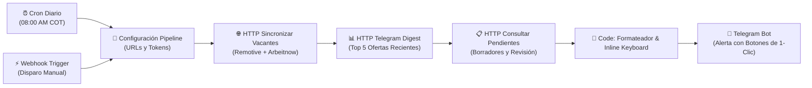

# ⚙️ Automatización n8n — JobAutoApply Radar & Bot Telegram

Workflow automatizado para orquestar la ingesta diaria de vacantes públicas, extracción de ofertas con ATS detectado y envío de un resumen matutino con botones de postulación interactiva a tu **Bot de Telegram**.

---

## 📋 Arquitectura del Workflow (Flujo Secuencial Lineal)



### Nodos que componen el flujo:
1. **Cron Diario 08:00 COT (`scheduleTrigger`):** Ejecución automática a las 8:00 AM (Zona horaria `America/Bogota`).
2. **Disparo Manual / Webhook (`webhook`):** Endpoint interno para forzar la sincronización en cualquier momento (`POST /webhook/job-autoapply-trigger`).
3. **Configuración Pipeline (`set`):** Define `app_url`, `webhook_secret` y `telegram_chat_id` (vía variables de entorno o valores por defecto).
4. **HTTP Sincronizar Vacantes (`httpRequest`):** Llama a `/api/webhooks/n8n` con acción `sync_jobs`. Realiza ingesta idempotente a Supabase.
5. **HTTP Telegram Digest (`httpRequest`):** Llama a `/api/webhooks/n8n` con acción `telegram_digest`. Extrae las ofertas más recientes y genera deep links directos hacia el generador de la app (`/dashboard?job_id=...`).
6. **HTTP Consultar Pendientes (`httpRequest`):** Llama a `/api/webhooks/n8n` con acción `get_pending`. Informa si tienes postulaciones en estado *Borrador* o *Lista para revisión*.
7. **Code Ensamblar Mensaje y Botones (`code`):** Consolida los datos en un mensaje Markdown sanitizado para Telegram y construye un teclado interactivo (*Inline Keyboard* con URLs directas).
8. **Telegram Enviar Alerta (`telegram`):** Despacha la notificación a tu chat con vista previa desactivada y botones de navegación rápida.

---

## 🚀 Cómo importarlo en tu VPS de Oracle Cloud (`130.61.96.49`)

En tu servidor de producción, n8n corre en Docker Compose dentro de `~/torre-control`.

### Paso 1: Configurar Credencial de Telegram en n8n
> ⚠️ **Lección de n8n 2.40:** Al importar por CLI (`n8n import:workflow`), n8n descarta conexiones a credenciales que no existan previamente en la base de datos de n8n.

1. Abre n8n en el navegador: `http://130.61.96.49:5678`
2. Ve a **Credentials** > **Add Credential** > **Telegram API**.
3. Nómbrala exactamente: `Telegram Bot (JobAutoApply)` (o reutiliza tu credencial existente de Telegram).
4. Ingresa el `Access Token` provisto por `@BotFather` y guarda.

### Paso 2: Copiar el workflow al VPS

Desde tu terminal local (PowerShell o WSL):
```bash
scp n8n/job_autoapply_pipeline.json ubuntu@130.61.96.49:~/torre-control/workflows/
```

### Paso 3: Importar y Activar el Workflow

Conéctate por SSH a tu VPS:
```bash
ssh ubuntu@130.61.96.49
cd ~/torre-control

# 1. Importar el workflow dentro del contenedor Docker de n8n
docker compose exec -u node n8n n8n import:workflow --input=/workflows/job_autoapply_pipeline.json

# 2. Obtener el ID asignado
docker compose exec -u node n8n n8n list:workflow

# 3. Publicar/activar el workflow (reemplaza <ID_DEL_WORKFLOW>)
docker compose exec -u node n8n n8n publish:workflow --id=<ID_DEL_WORKFLOW>

# 4. Reiniciar el contenedor n8n (regla obligatoria de n8n 2.40 para aplicar cambios en caliente)
docker compose restart n8n
```

---

## 🔑 Variables de Entorno y Configuración

Puedes configurar las siguientes variables en el archivo `.env` de tu n8n en el VPS (`~/torre-control/.env`) o editarlas directamente en el nodo **Configuración Pipeline**:

| Variable | Descripción | Valor por Defecto / Ejemplo |
|---|---|---|
| `JOB_AUTOAPPLY_URL` | URL pública o IP donde corre tu app JobAutoApply | `http://localhost:3000` o `https://tu-dominio.com` |
| `JOB_AUTOAPPLY_SECRET` | Token secreto configurado en `N8N_WEBHOOK_SECRET` | El mismo valor que pusiste en el `.env.local` de la app |
| `TELEGRAM_CHAT_ID` | Tu ID de chat en Telegram para recibir las alertas | Tu ID numérico (ej. `123456789`) |

---

## 🧪 Cómo probarlo

1. **Desde la interfaz web de n8n (`http://130.61.96.49:5678`):**
   - Abre el workflow `Job AutoApply · Radar Diario & Asistente Telegram`.
   - Haz clic en **Test workflow** (Ejecutar flujo).
   - Verifica que cada nodo se ilumine en verde y que el mensaje llegue a tu Telegram con los botones interactivos.
2. **Vía cURL o webhook manual:**
   ```bash
   curl -X POST http://130.61.96.49:5678/webhook/job-autoapply-trigger
   ```
